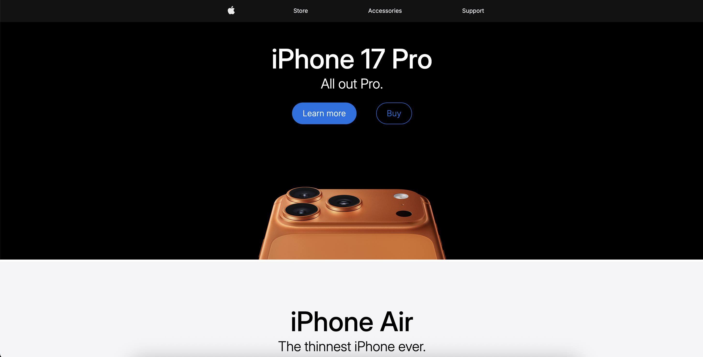

# 🍎 Apple Website Redesign (HTML & CSS)

---

## 🌟 Project Overview
This project is a **static recreation of several Apple website pages** using HTML and CSS, with **responsive design for mobile, tablet, and desktop screens**.  
The goal was to **emulate Apple's design, layout, and typography** while keeping the project lightweight and purely front-end.

---

## 🎯 Features
- Static **Home (index), Store, Support, Accessories, 404 Error, and Sign In pages**  
- **Header, navigation menu, dropdown menu, product showcases, footer**  
- Layout implemented using **various CSS techniques**: Flexbox, Grid, `block`, `inline-block`, positioning  
- Fully **responsive design** for **mobile, tablet, and desktop**  
- **Tailwind CSS** used for utility classes and responsive layout helpers  
- Pure **HTML & CSS**, minimal interactivity, no JavaScript functionality

---

## 🛠 Tech Stack
- **HTML5**  
- **CSS3** (Flexbox, Grid, block, inline-block, positioning)  
- **Tailwind CSS** (utility-first classes for responsive layouts and spacing)